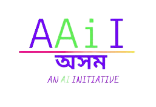

   

## Assam Artificial Intelligence Initiative (AAII)
**Assam Artificial Intelligence Initiative (AAII)** is an initiative to promote AI in Assam/NE region and to build a network for students/researchers/AI-enthusiasts to exchange knowledge.

### Specific objectives:
- `Networking:` Provide exposure to students/researchers/AI-enthusiast through this platform for fulfilling their AI-dreams. And it will facilitate networking with AI-related companies and highly experienced AI researchers (from all areas, such as biological science, physical science, statistics, maths, social science).

- `Mentoring:` This society will provide mentoring in conducting AI-related the undergraduate/master projects.

- `Event organization:` Experienced researchers/scientists from industry and academia will be invited to deliver talks/tutorials on AI/ML/DL/RL. And also interview them on specific problems related to the Assam or NE region, and the possibilities to solve them using AI.

- `AI popularization:` Several activities, such as general AI talks for school children/non-specialists and general AI-related articles, will be conducted to promote AI.

## Social media links for AAII
- [Youtube](https://www.youtube.com/channel/UCLpwr-48gchMdhc_F2a9hLg)
- [Linkedin](https://www.linkedin.com/in/assam-ai-initiative-aaii-5aa108205)
- Mail us at *aaiiaxomi [at] gmail [dot] com*
